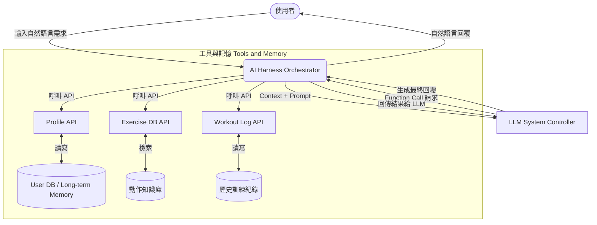
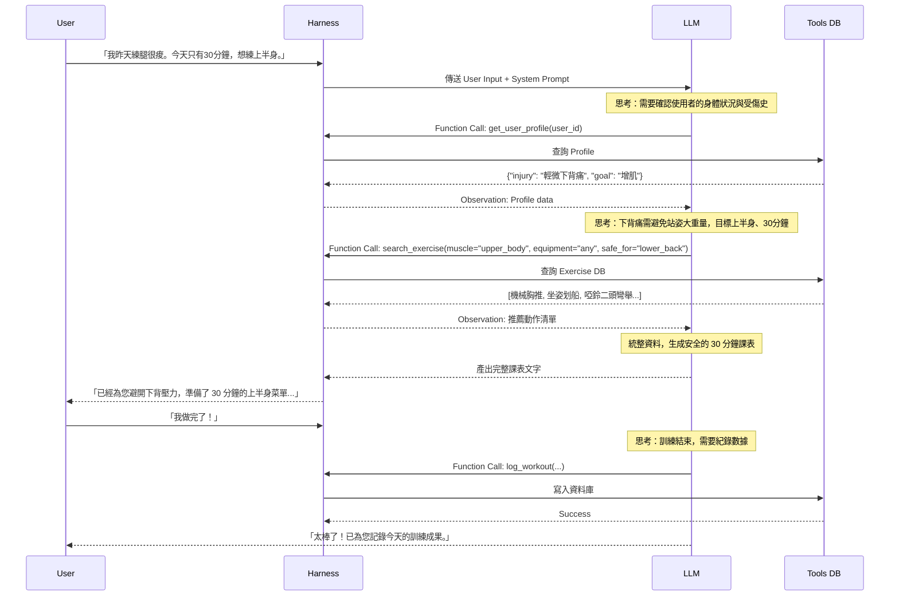

# AI 私人健身教練：基於 AI Harness 的智慧化運動編排系統

## 一、問題定義與應用背景

### 1. 應用背景
隨著健康意識抬頭，越來越多人投入健身運動。然而，聘請實體私人教練費用高昂，而市面上多數的健身 App 只能提供靜態、固定的訓練課表。這類「罐頭菜單」無法根據使用者每天的動態身體狀況（如：肌肉痠痛、睡眠不足）、時間限制或器材限制進行調整，導致使用者難以長期堅持並容易受傷。

### 2. 問題定義與痛點
大型語言模型（LLM，如 ChatGPT）雖然具備豐富的健身知識，但若單純依賴其進行對話，會面臨以下問題：
- **缺乏狀態記憶（No Memory）**：無法記住使用者過往的訓練量與受傷紀錄。
- **資訊幻覺（Hallucination）**：LLM 可能會推薦不存在或不符合人體工學的動作。
- **無法串接真實數據（No Action）**：無法將使用者的訓練結果寫入資料庫進行長期追蹤。

### 3. 解決方案：AI Harness 系統
本專案旨在設計一套「AI 私人健身教練系統」，透過 **AI Harness** 架構，將 LLM 升級為 System Controller（系統控制器）。藉由整合 Function Calling、外部資料庫（Tools）與長短期記憶機制（Memory），打造一個能「動態評估、安全排表、追蹤進度」的 Agentic Workflow。

---

## 二、AI Harness 系統設計

本系統架構將 LLM 作為核心的推理引擎，透過 Harness 進行流程控制，串接各項外部資源。

### 1. System Controller (系統控制器)
由 LLM 擔任決策大腦。採用 **ReAct (Reasoning and Acting)** 框架，LLM 在給出答案前，必須先輸出 `Thought` (分析目前情況與使用者需求)，接著進行 `Action` (選擇要呼叫的工具)，最後根據 `Observation` (工具回傳的結果) 給出 `Answer`。

### 2. Memory (記憶機制)
- **短期記憶 (Session Memory)**：維持在對話的 Context Window 內，負責記住當下這次訓練中的對話（如：「這個重量太重了，幫我調輕」）。
- **長期記憶 (Long-term Memory)**：儲存於關聯式資料庫中，包含使用者的身高、體重、目標（減脂/增肌）、舊傷紀錄，以及過往的每一筆訓練日誌。

---

## 三、Tools 設計 (工具與 API)

為了避免 LLM 產生幻覺並賦予其操作資料的能力，系統設計了以下 3 個核心工具（Function Calling），LLM 必須透過呼叫這些工具來完成任務。

| 工具名稱 | 輸入參數 (Parameters) | 輸出結果 (Returns) | 設計目的與情境 |
| :--- | :--- | :--- | :--- |
| `get_user_profile` | `user_id` (string) | 使用者的身高、體重、目標、**舊傷與禁忌症**。 | LLM 在排課表前**必須**呼叫此工具，了解使用者是否有受傷（如：膝蓋受傷不能深蹲），確保安全性。 |
| `search_exercise` | `muscle_group` (string) `equipment` (string) `max_duration` (int) | 符合條件的動作清單、建議組數與次數。 | 當 LLM 決定好今天要練什麼部位後，透過此工具從**專業動作庫**中撈取動作，防止 LLM 自己亂編動作。 |
| `log_workout` | `user_id` (string) `date` (date) `exercises` (list) `duration` (int) | 儲存成功的確認訊息。 | 使用者回報完成訓練後，LLM 呼叫此工具將數據寫入資料庫，作為未來的長期記憶。 |

---

## 四、Agent Workflow (多步驟任務執行流程)

本系統處理一次使用者請求，涉及多個步驟的狀態流轉（State Transitions）。以下為典型的「動態菜單生成」工作流：

---

## 五、Evaluation 方法 (系統效果衡量)

相較於傳統機器學習評估「準確率」，AI Harness 系統的評估更著重於「決策邏輯」與「安全性」。本系統採用以下三個指標進行評估：

### 1. 限制條件達成率 (Constraint Satisfaction Rate) - 安全性首要指標
- **定義**：系統生成的菜單，完全符合使用者 Profile 中「舊傷、禁忌症、時間限制、器材限制」的比例。
- **衡量方式**：輸入 100 筆帶有特定限制（如：無器材、膝蓋受傷）的測試案例，檢查最終輸出的菜單中，是否包含不該出現的動作（如：深蹲）。
- **目標**：必須達到 100%，確保運動安全。

### 2. 工具選擇準確度 (Tool Selection Accuracy)
- **定義**：LLM 是否在正確的時機點，呼叫正確的工具並傳入正確的參數。
- **衡量方式**：透過 LLM as a Judge 或人工標註，檢視 Agent Workflow 的 Log。例如：當使用者說「記錄我今天的體重變成 70 公斤」時，LLM 必須呼叫 Profile API，而不是呼叫 `search_exercise`。

### 3. 任務完成率 (Workflow Completion Rate)
- **定義**：使用者從「提出需求」到「完成訓練並成功寫入 Log」的完整對話中，沒有發生死胡同（Dead-end）、無限迴圈或系統錯誤的比例。
- **衡量方式**：計算在真實或模擬測試環境中，順利走完 `get_profile` -> `search_exercise` -> `log_workout` 完整生命週期的對話 Session 佔比。

> [!TIP]
> 結論：透過 AI Harness，我們不僅利用了 LLM 強大的語意理解與推理能力，更透過嚴格的 Tool Calling 機制，解決了 AI 應用在醫療健身領域最致命的「幻覺」與「無法個人化記憶」問題，實現了真正具備行動力與安全性的 AI 代理。
